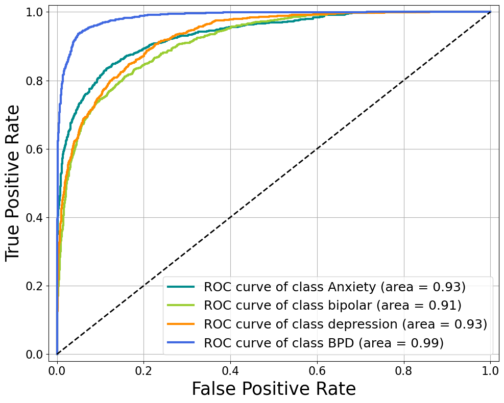
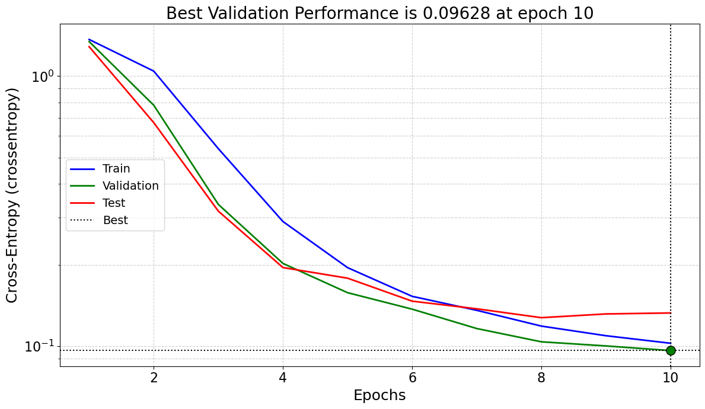
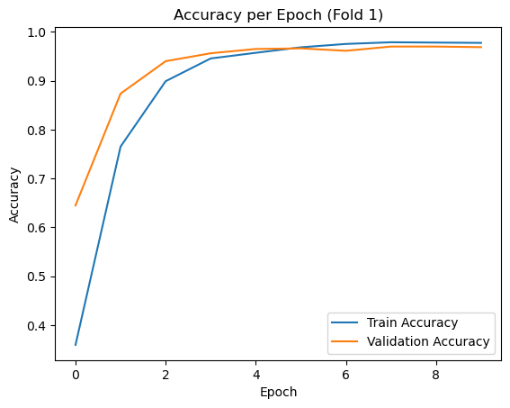
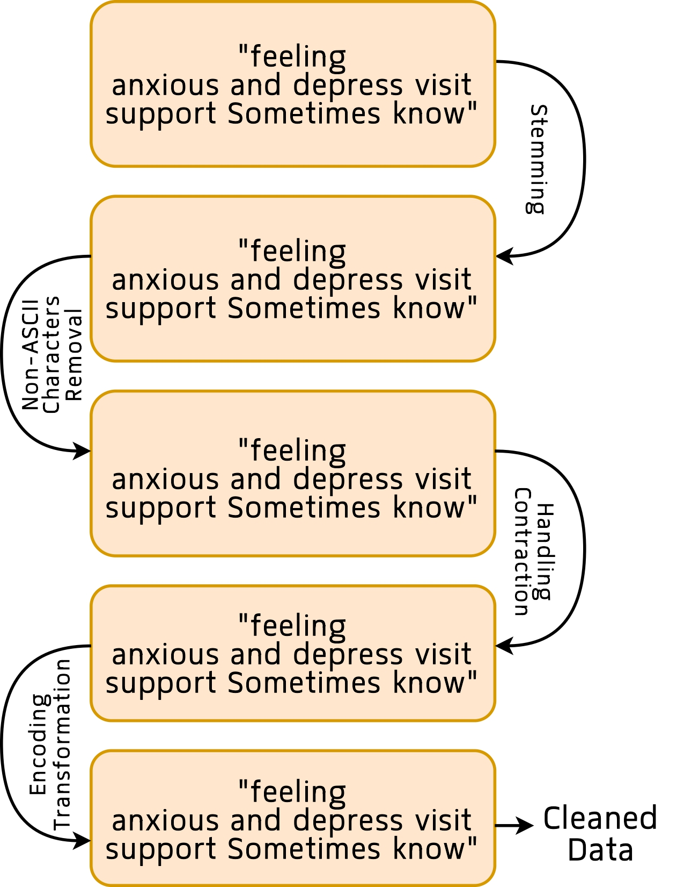
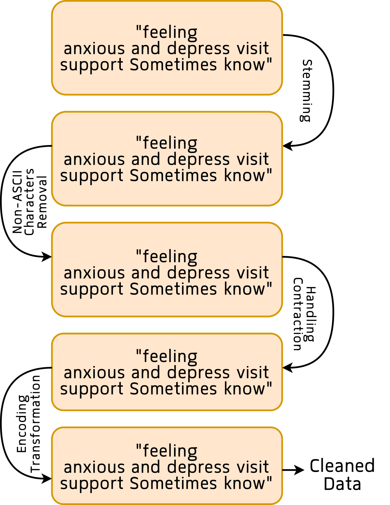

# Conversational AI for Mental Disorder Detection

This repository provides the implementation of a research-grade conversational AI framework for mental health classification. It integrates GPT-3.5 for adaptive patient conversation and a fine-tuned DistilRoBERTa classifier to predict mental disorders such as anxiety, depression, bipolar disorder, and borderline personality disorder (BPD).

---

## 📌 Table of Contents
1. [Overview](#overview)
2. [Key Features](#key-features)
3. [Dataset Sources](#dataset-sources)
4. [Code Structure](#code-structure)
5. [Installation](#installation)
6. [Reproducibility Guide](#reproducibility-guide)
7. [Results & Visualizations](#results)
8. [Citation](#citation)
9. [License](#license)

---

## 📖 Overview

This project proposes a lightweight, efficient, and interpretable hybrid system that:
- Engages in human-like conversation using GPT-3.5.
- Classifies mental health conditions using a fine-tuned DistilRoBERTa model.
- Utilizes a Sentence-BERT + t-SNE sampling technique for balanced dataset construction.
- Supports real-time conversation and diagnosis with audio/text interaction.

---

## ✨ Key Features
- 🧠 **Conversational AI**: Human-like dialogue using GPT-3.5.
- 🎯 **Mental Health Classification**: Trained DistilRoBERTa classifier.
- 🧪 **t-SNE Sampling**: Representative sample selection.
- ⚡ **Low Latency**: Inference time ~1.67 ms per sample.
- 🗣️ **Voice + Text Support**: Multi-modal communication.
- 🔐 **Privacy Respectful**: No data stored or logged permanently.

---

## 📂 Dataset Sources

| Purpose        | Dataset | Link |
|----------------|---------|------|
| Conversation   | Mental Health Conversational Dataset | [Kaggle](https://www.kaggle.com/datasets/elvis23/mental-health-conversational-data) |
| Classification | Mental Disorders Reddit NLP Dataset | [Kaggle](https://www.kaggle.com/datasets/kamaruladha/mental-disorders-identification-reddit-nlp) |

---

## 🗂️ Code Structure

| File | Description |
|------|-------------|
| `data_cleaning.py` | Clean and preprocess raw CSV dataset. |
| `sampling_tsne.py` | Perform Sentence-BERT + t-SNE-based sampling. |
| `Classification_Kfold.py` | Run 5-fold cross-validation on classifier. |
| `main_file.py` | Run GPT-3.5 based conversational agent (standalone). |
| `requirements.txt` | Python dependencies. |

---

## ⚙️ Installation

```bash
git clone https://github.com/diwakardkk/Conversational-AI.git
cd Conversational-AI
pip install -r requirements.txt
```
### Environment Setup:
```bash
Python 3.8+
PyTorch, Transformers, Scikit-learn
HuggingFace and OpenAI API keys (for GPT-3.5)
```
## 🧪 Reproducibility Guide
To reproduce the results of this research, follow the steps below:
### Step 1: Clean the Dataset
```bash
python data_cleaning.py --input raw_data.csv --output cleaned_data.csv
```

### Step 2: Run t-SNE Sampling
```bash
python sampling_tsne.py --input cleaned_data.csv --output sampled_data.csv --samples_per_class 1000

```
### Step 3: Train Classifier (Cross-validation)
```bash
python Classification_Kfold.py --input sampled_data.csv
```
### Step 4: Run Conversational Agent
```bash
python main_file.py
```
Uses GPT-3.5 to simulate conversation and trigger disease-specific questioning.
Requires OpenAI API key configured as an environment variable.


## 📊 Results & Visualizations

Below are the core visual outputs generated by the pipeline.  
All images are located in the `results/` directory of this repository.

| Visualization | Description |
|---------------|-------------|
|  | **Figure&nbsp;1.** ROC curves (per‐class, micro, and macro) demonstrating an overall AUC > 0.91 across all mental-health categories. |
|  | **Figure&nbsp;2.** Cross-entropy loss vs. epochs (training & validation). The “best-val” dotted line marks the epoch with lowest validation loss. |
|  | **Figure&nbsp;3.** Training and validation accuracy curves. Both plateau above 95 %, indicating strong generalization with minimal overfitting. |
<table>
  <tr>
    <td></td>
    <td></td>
  </tr>
  <tr>
    <td><strong>Figure&nbsp;2.</strong> (Part 1) End-to-end text-cleaning workflow, including Unicode normalization, URL removal, contraction expansion, and lemmatization.</td>
    <td><strong>Figure&nbsp;2.</strong> (Part 2).</td>
  </tr>
</table>


> **Tip:** If you regenerate the figures, ensure they are saved in `results/` with the same filenames so the links above remain valid.


## 🧾 Performance Summary

| 🧪 **Metric**    | 🔢 **Score**        |
|------------------|---------------------|
| Accuracy         | 96.27%              |
| Precision        | 95.28%              |
| Recall           | 96.12%              |
| F1-score         | 96.27%              |
| Inference Time   | 1.67 ms/sample      |

## 📊 Key Evaluation Highlights

- ✅ **Inference Time**: 1.67 ms per sample (tested over 4000 test instances)
- 📈 **ROC-AUC**: Greater than 0.91 for both micro and macro averages
- 🔁 **Cross-Validation**: 5-Fold validation showing consistent performance across all folds


## Running the System
1. **Required fine-tuned GPT 3.5 API**:


## Contributing
Contributions are welcome! Please fork the repository and submit a pull request. For major changes, please open an issue to discuss what you would like to change.

## License

This project is licensed under the MIT License - see the LICENSE file for details.

MIT License

Copyright (c) 2024 Diwakar

Permission is hereby granted, free of charge, to any person obtaining a copy
of this software and associated documentation files (the "Software"), to deal
in the Software without restriction, including without limitation the rights
to use, copy, modify, merge, publish, distribute, sublicense, and/or sell
copies of the Software, and to permit persons to whom the Software is
furnished to do so, subject to the following conditions:

The above copyright notice and this permission notice shall be included in all
copies or substantial portions of the Software.

THE SOFTWARE IS PROVIDED "AS IS", WITHOUT WARRANTY OF ANY KIND, EXPRESS OR
IMPLIED, INCLUDING BUT NOT LIMITED TO THE WARRANTIES OF MERCHANTABILITY,
FITNESS FOR A PARTICULAR PURPOSE AND NONINFRINGEMENT. IN NO EVENT SHALL THE
AUTHORS OR COPYRIGHT HOLDERS BE LIABLE FOR ANY CLAIM, DAMAGES OR OTHER
LIABILITY, WHETHER IN AN ACTION OF CONTRACT, TORT OR OTHERWISE, ARISING FROM,
OUT OF OR IN CONNECTION WITH THE SOFTWARE OR THE USE OR OTHER DEALINGS IN THE
SOFTWARE.
   
